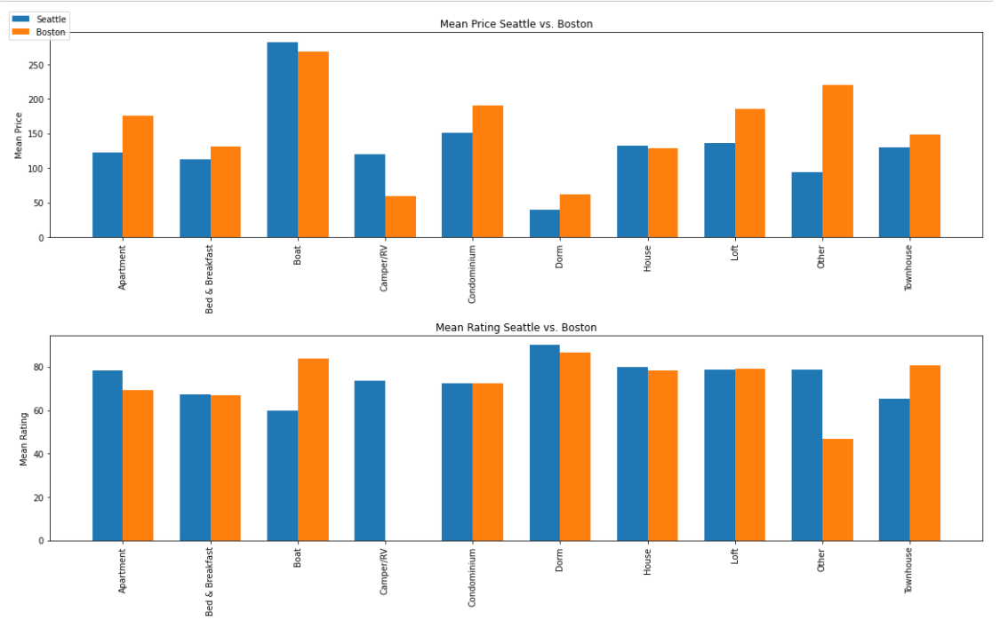

## Business understanding:
 In the beginning, to properly analyze the data and reach
effective results, we must ask the right questions that lead
to useful results. Therefore, three important questions
were asked:
 1- What is the average price for each type of housing in
Seattle versus Boston?
 2- What is the average rating for each housing type in
Seattle versus Boston?
 3- How can we expect the prices?
Through these three questions, we can reach effective
answers and results that have a major relationship to the
preferences of customers and what they are looking for
and preferring in residences in Seattle and Boston, and to
find answers to all the questions asked we must be
concerned with 4 types of data related to the answer,
namely 'id', 'property_type', 'price', 'review_scores_rating'
Then By measuring the average prices, we can reach the
most important financial information regarding the rate of
customer payment, as follows:
Average Prices and Ratings in Boston and Seattle:

After I got average prices and reviews, I created a chart
 A graph for comparing average prices and valuations
between the two cities as follows:

- data understanding
 After extracting the existing data, we need to analyze
and interpret the data results, and through our
understanding of the results related to the data, we can
reach the following:
 1- Average apartment prices in Boston are more
expensive than Seattle, but the average valuation in
Seattle is 9 points higher than Boston, and this is an
indicator that means that Boston realtors need to develop
their services better due to the big price difference in
Boston's favor of $ 53. Against their high prices.
 2- Average prices for breakfast and bed services in
Boston outperform Seattle by $ 27, but customers are
satisfied with these services in Seattle by very little.
 3- Boat prices in Seattle are $ 14 higher than Boston
prices, but Boston's customer satisfaction level is 24
degrees higher than Seattle, which means boat owners in
Seattle
 They need to improve their services or lower their rates
because of the big difference compared to the prices in
Seattle.
 By comparing customers in the two cities, we can
conclude that the level of customer satisfaction in Seattle
is often higher than that of Boston, but the level of prices
in Boston is more expensive, and in general, the data
indicates that Boston is more expensive than Seattle.

- data preparation (in the code)
- The form in the code
- Rating: in the Code
